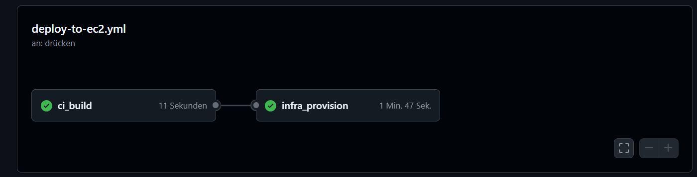
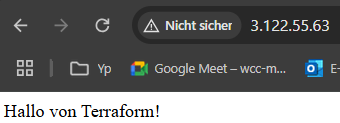

# React AWS CI/CD

Dieses Projekt zeigt, wie eine React-Anwendung mithilfe von Terraform und GitHub Actions automatisiert auf einer AWS EC2-Instanz bereitgestellt wird.

## Technologie-Stack

- React (Vite)
- Terraform
- GitHub Actions für CI/CD
- AWS EC2, S3, optional DynamoDB
- NGINX als Webserver

## Projektstruktur

my-react-app/
├── .github/workflows/deploy-to-ec2.yml # GitHub Actions Workflow
├── terraform/ # Terraform-Konfigurationen
├── src/ # React Source Code
├── dist/ # Build Output (wird auf EC2 deployed)
├── .gitignore
├── README.md
└── ...

markdown
Kopieren
Bearbeiten

## Setup und Voraussetzungen

### AWS-Konfiguration

Im Projekt werden folgende AWS-Ressourcen genutzt:

- EC2-Instanz
- S3-Bucket für Terraform-State
- optional: DynamoDB für Locking

Erforderliche GitHub Secrets:

- `AWS_ACCESS_KEY_ID`
- `AWS_SECRET_ACCESS_KEY`
- `AWS_REGION`
- `TF_BUCKET_NAME` (z. B. my-blog1)
- `SSH_PUBLIC_KEY`
- `SSH_PRIVATE_KEY`

### Lokale Ausführung

Repository klonen und App lokal installieren:

git clone https://github.com/<username>/react-aws-cicd.git
cd my-react-app
npm install
npm run build

shell
Kopieren
Bearbeiten

### Terraform ausführen

cd terraform
terraform init
terraform apply -auto-approve -var="aws_region=..." -var="ssh_key_name=terraform-key" -var="ssh_public_key=..." -var="bucket_name=..."

markdown
Kopieren
Bearbeiten

## GitHub Actions Workflow

Bei jedem Push auf den `main`-Branch wird automatisch folgendes ausgeführt:

1. Abhängigkeiten installieren und React-App bauen
2. Terraform-Deployment zur Provisionierung der Infrastruktur
3. Deployment des Build-Ordners per SCP auf die EC2-Instanz

## Hinweise zur EC2-Konfiguration

- NGINX wird auf der EC2-Instanz installiert und so konfiguriert, dass es die React-App aus dem Verzeichnis `/var/www/html` ausliefert.
- Die `user_data` in Terraform installiert NGINX.
- Alternativ wird der `dist/`-Ordner per GitHub Actions und SCP nach dem Build auf die Instanz übertragen.

## Screenshots

### Erfolgreicher CI/CD-Workflow

### Terraform Init

### Terraform Apply

### React App im Browser erreichbar

### AWS EC2 Instanz erfolgreich erstellt  
Die EC2-Instanz `react-app-server` wurde erfolgreich von Terraform bereitgestellt und ist im Status **"running"**.  

